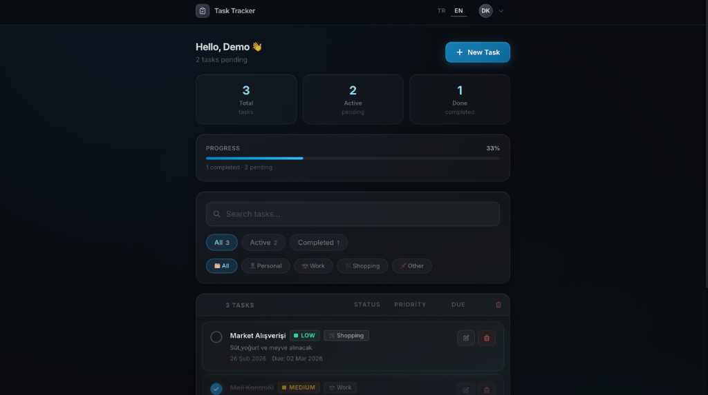
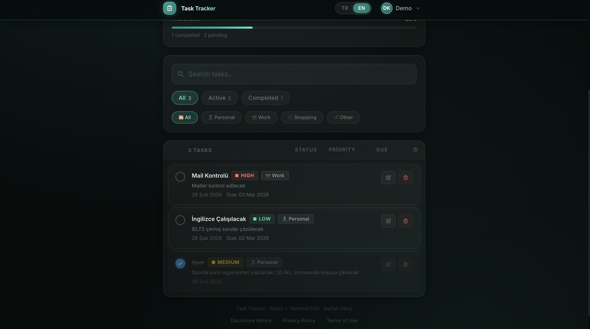
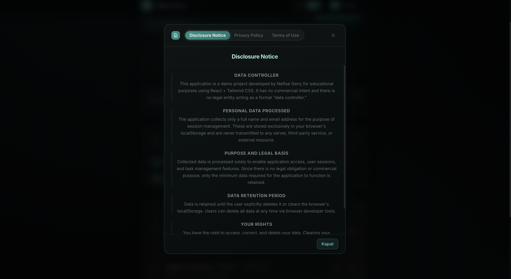

# ✅ Task Tracker — Checklist App

A task management web application developed as a Web Development course assignment.

## 🚀 Technologies Used

| Technology | Purpose |
|-----------|------|
| **React 18** | UI library (with Vite) |
| **Tailwind CSS 3** | Styling / design |
| **localStorage** | Persistent data storage in the browser |

## 📁 Project Structure

```
src/
├── components/
│   ├── TaskForm.jsx      # Task add & update form
│   ├── TaskItem.jsx      # Single task row
│   ├── TaskList.jsx      # Task list
│   └── TaskFilter.jsx    # Search & filter bar
├── interfaces/
│   └── Task.js           # Task data model & constants
├── pages/
│   └── HomePage.jsx      # Home page (CRUD management)
├── App.jsx
├── main.jsx
└── index.css
```

## ⚙️ Installation

```bash
npm install
npm run dev
```

## 🌐 Deploying with Netlify

After pushing the project to GitHub and connecting it to Netlify, deployment happens automatically. You can also do it manually:

```bash
npm run build
# then upload the dist/ folder via the Netlify dashboard or CLI (`netlify deploy --prod`)
```

Live URL: **https://<your-site-name>.netlify.app/**  *(Copy from your Netlify dashboard)*

## 🔑 Features (CRUD)

- ➕ **Create** — Add a task with title, description, priority, category and due date
- 📋 **Read** — List all tasks; search, filter by status and category
- ✏️ **Update** — Edit and save an existing task
- 🗑️ **Delete** — Permanently remove a task

## 📸 Screenshots

### Home Page — With Tasks


### Home Page — Empty State


### Task List


### Policy Modal

