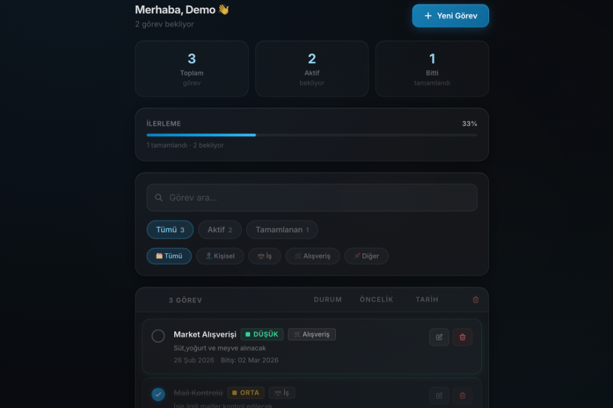
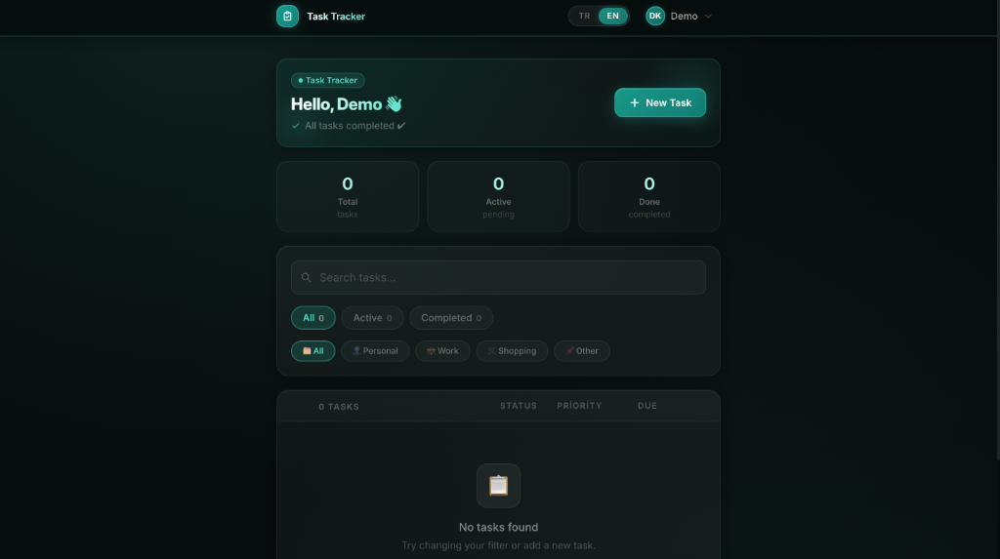
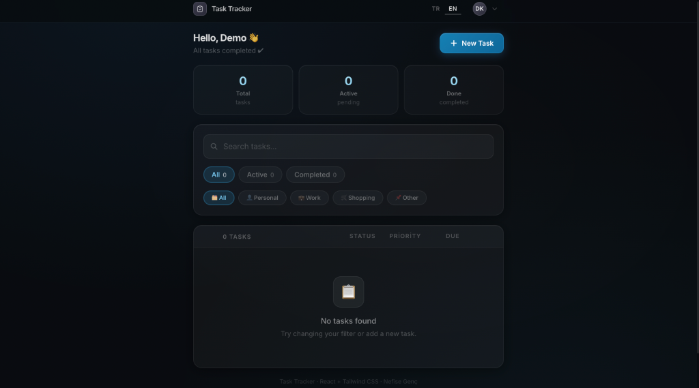
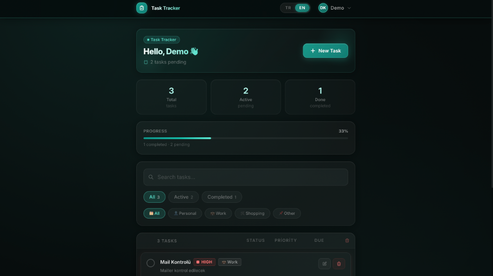
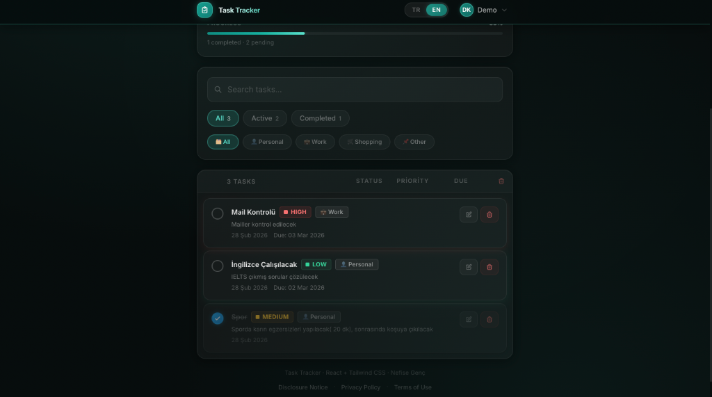
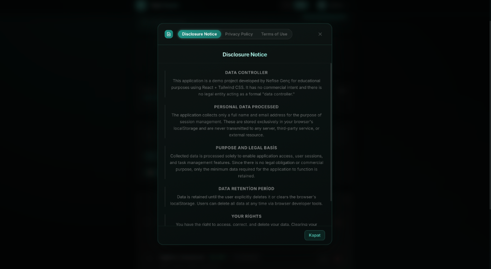

# Task Tracker

A responsive task management application built with **React**, **Tailwind CSS**, and **Vite**. Supports bilingual (TR/EN) interface, task categories, priority levels, due dates, and local persistence via JSON Server.

---

## Features

- Add, edit, delete tasks
- Mark tasks as completed
- Filter by status (All / Active / Completed) and category (Personal, Work, Shopping, Other)
- Search tasks by keyword
- Priority levels: Low, Medium, High
- Due date support
- Progress bar
- Bilingual UI (Turkish / English)
- Authentication page (Login / Register)
- Privacy Policy modal
- Dark theme

---

## Tech Stack

| Layer | Technology |
|---|---|
| UI | React 18, Tailwind CSS 3 |
| Build | Vite 6 |
| API | JSON Server 0.17 |
| Testing | Vitest, Testing Library |

---

## Getting Started

```bash
# Install dependencies
npm install

# Start the JSON Server (port 4000)
npm run serve:api

# Start the dev server (port 5173)
npm run dev
```

---

## Running Tests

```bash
npm test
```

---

## Screenshots

### Login


### Home – Empty State


### Home


### Home – Task List


### Home – Turkish


### Privacy Policy Modal


---

## Project Structure

```
src/
├── components/     # Nav